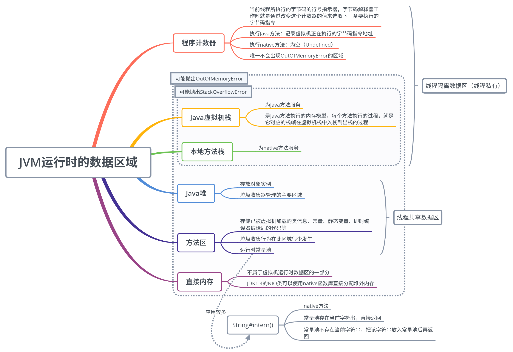
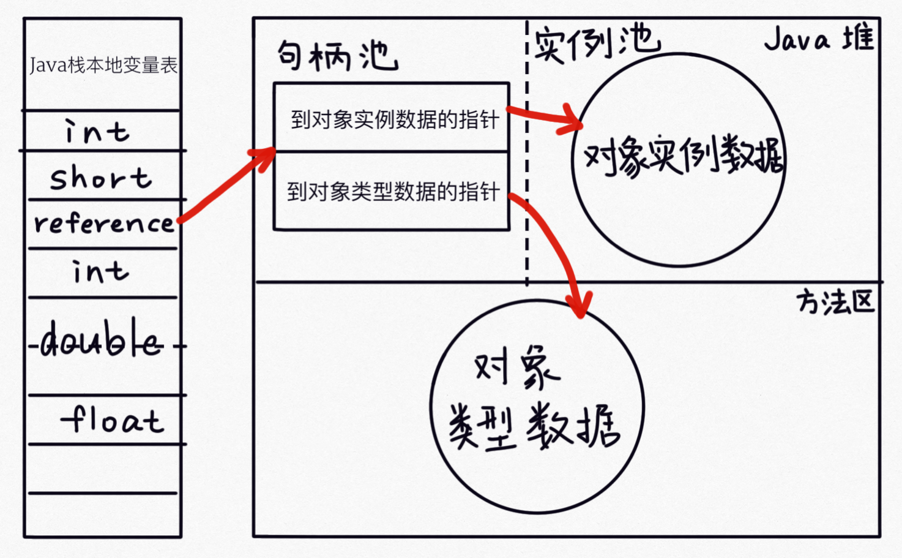
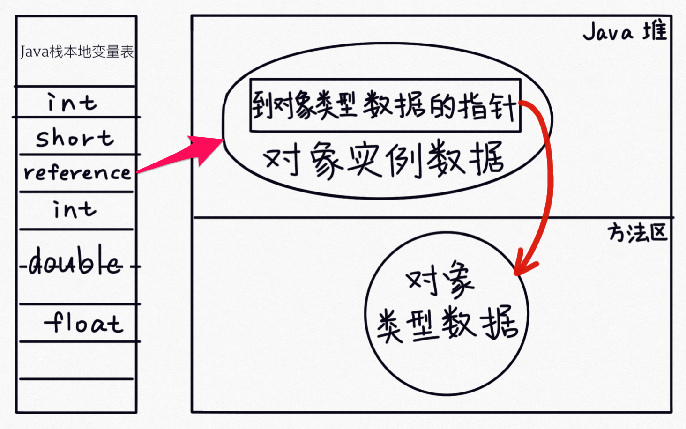

# Java 内存区域详解

<!-- TOC -->

- [Java 内存区域详解](#java-内存区域详解)
    - [JVM 运行时的数据区域](#jvm-运行时的数据区域)
        - [程序计数器](#程序计数器)
        - [Java 虚拟机栈](#java-虚拟机栈)
        - [本地方法栈](#本地方法栈)
        - [Java 堆](#java-堆)
        - [方法区](#方法区)
        - [直接内存](#直接内存)
    - [HotSpot 虚拟机堆中的对象](#hotspot-虚拟机堆中的对象)
        - [对象的创建（遇到一条 new 指令时）](#对象的创建遇到一条-new-指令时)
        - [对象的内存布局](#对象的内存布局)
        - [对象的访问](#对象的访问)
            - [句柄访问](#句柄访问)
            - [直接指针访问](#直接指针访问)

<!-- /TOC -->

## JVM 运行时的数据区域

首先获取一个直观的认识：

总共也就这么 5 个区（直接内存不属于 JVM 运行时数据区的一部分），除了程序计数器其他的地方都有可能出现 OOM (OutOfMemoryError)，其中像是程序计数器和两个栈（Java 虚拟机栈 & 本地方法栈）都是每个线程要有一个的，所以肯定是线程隔离的。而其他 2 个区就是线程共享的了，也就是说，如果有多个线程要同时访问这两个区的数据，是会出现线程安全问题的。接下来，我们将对这些区域进行详细的介绍。

### 程序计数器

- 当前线程所执行的字节码的行号指示器，字节码解释器工作时就是通过改变这个计数器的值来确定下一条要执行的字节码指令的位置
- 执行 Java 方法和 native 方法时的区别：
	- 执行 Java 方法时：记录虚拟机正在执行的字节码指令地址；
	- 执行 native 方法时：无定义；
- 是 5 个区域中唯一不会出现 OOM 的区域。

### Java 虚拟机栈

- Java 方法执行的内存模型，每个方法执行的过程，就是它所对应的栈帧在虚拟机栈中入栈到出栈的过程；
- 服务于 Java 方法；
- 可能抛出的异常：
	- OutOfMemoryError（在虚拟机栈可以动态扩展的情况下，扩展时无法申请到足够的内存）；
	- StackOverflowError（线程请求的栈深度 > 虚拟机所允许的深度）；
- 虚拟机参数设置：`-Xss`.

### 本地方法栈

- 服务于 native 方法；
- 可能抛出的异常：与 Java 虚拟机栈一样。

### Java 堆

- 唯一的目的：存放对象实例；
- 垃圾收集器管理的主要区域；
- 可以处于物理上不连续的内存空间中；
- 可能抛出的异常：
	- OutOfMemoryError（堆中没有内存可以分配给新创建的实例，并且堆也无法再继续扩展了）。
- 虚拟机参数设置：
	- 最大值：`-Xmx`
	- 最小值：`-Xms`
	- 两个参数设置成相同的值可避免堆自动扩展。

### 方法区

- 存储已被虚拟机加载的类信息、常量、静态变量、即时编译器编译后的代码等数据；	
	- 类信息：即 Class 类，如类名、访问修饰符、常量池、字段描述、方法描述等。
- 垃圾收集行为在此区域很少发生；
	- 不过也不能不清理，对于经常动态生成大量 Class 的应用，如 Spring 等，需要特别注意类的回收状况。
- 运行时常量池也是方法区的一部分；
	- Class 文件中除了有类的版本、字段、方法、接口等描述信息外，还有一项是常量池，用于存放编译器生成的各种字面量（就是代码中定义的 static final 常量）和符号引用，这部分信息就存储在运行时常量池中。
- 可能抛出的异常：
	- OutOfMemoryError（方法区无法满足内存分配需求时）。

### 直接内存

- JDK 1.4 的 NIO 类可以使用 native 函数库直接分配堆外内存，这是一种基于通道与缓冲区的 I/O 方式，它在 Java 堆中存储一个 DirectByteBuffer 对象作为堆外内存的引用，这样就可以对堆外内存进行操作了。因为可以避免 Java 堆和 Native 堆之间来回复制数据，在一些场景可以带来显著的性能提高。
- 虚拟机参数设置：`-XX:MaxDirectMemorySize`
	- 默认等于 Java 堆最大值，即 `-Xmx` 指定的值。
- 将直接内存放在这里讲解的原因是它也可能会出现 OutOfMemoryError；
	- 服务器管理员在配置 JVM 参数时，会根据机器的实际内存设置 `-Xmx` 等信息，但经常会忽略直接内存（默认等于 `-Xmx` 设置值），这可能会使得各个内存区域的总和大于物理内存限制，从而导致动态扩展时出现 OOM。

## HotSpot 虚拟机堆中的对象

这一小节将对 JVM 对 Java 堆中的对象的创建、布局和访问的全过程进行讲解。

### 对象的创建（遇到一条 new 指令时）

1. 检查这个指令的参数能否在常量池中定位到一个类的符号引用，并检查这个符号引用代表的类是否已被加载、解析和初始化过。如果没有，先把这个类加载进内存；
2. 类加载检查通过后，虚拟机将为新对象分配内存，此时已经可以确定存储这个对象所需的内存大小；
3. 在堆中为新对象分配可用内存；
4. 将分配到的内存初始化；
5. 设置对象头中的数据；
6. 此时，从虚拟机的角度看，对象已经创建好了，但从 Java 程序的角度看，对象创建才刚刚开始，构造函数还没有执行。

第 3 步，在堆中为新对象分配可用内存时，会涉及到以下两个问题：

**如何在堆中为新对象划分可用的内存？**

- 指针碰撞（内存分配规整）
	- 用过的内存放一边，没用过的内存放一边，中间用一个指针分隔；
	- 分配内存的过程就是将指针向没用过的内存那边移动所需的长度；
- 空闲列表（内存分配不规整）
	- 维护一个列表，记录哪些内存块是可用的；
	- 分配内存时，从列表上选取一块足够大的空间分给对象，并更新列表上的记录；

**如何处理多线程创建对象时，划分内存的指针的同步问题？**

- 对分配内存空间的动作进行同步处理（CAS）；
- 把内存分配动作按照线程划分在不同的空间之中进行；
	- 每个线程在 Java 堆中预先分配一小块内存，称为本地线程分配缓冲（Thread Local Allocation Buffer，TLAB）；
	- 哪个线程要分配内存就在哪个线程的 TLAB 上分配，TLAB 用完需要分配新的 TLAB 时，才需要同步锁定；
	- 通过 `-XX:+/-UseTLAB` 参数设定是否使用 TLAB。

### 对象的内存布局

- 对象头：
	- 第一部分：存储对象自身运行时的数据，HashCode、GC分代年龄等（Mark Word）；
	- 第二部分：类型指针，指向它的类元数据的指针，虚拟机通过这个指针来判断这个对象是哪个类的实例（HotSpot 采用的是直接指针的方式访问对象的）；
	- 如果是个数组对象，对象头中还有一块用于记录数组长度的数据。
- 实例数据：
	- 默认分配顺序：longs/doubles、ints、shorts/chars、bytes/booleans、oops (Ordinary Object Pointers)，相同宽度的字段会被分配在一起，除了 oops，其他的长度由长到短；
	- 默认分配顺序下，父类字段会被分配在子类字段前面。

*注：HotSpot VM要求对象的起始地址必须是8字节的整数倍，所以不够要补齐。*

### 对象的访问

Java 程序需要通过虚拟机栈上的 reference 数据来操作堆上的具体对象，reference 数据是一个指向对象的引用，不过如何通过这个引用定位到具体的对象，目前主要有以下两种访问方式：句柄访问和直接指针访问。

#### 句柄访问

句柄访问会在 Java 堆中划分一块内存作为句柄池，每一个句柄存放着到对象实例数据和对象类型数据的指针。

优势：对象移动的时候（这在垃圾回收时十分常见）只需改变句柄池中对象实例数据的指针，不需要修改reference本身。

#### 直接指针访问

直接指针访问方式在 Java 堆对象的实例数据中存放了一个指向对象类型数据的指针，在 HotSpot 中，这个指针会被存放在对象头中。

优势：减少了一次指针定位对象实例数据的开销，速度更快。

