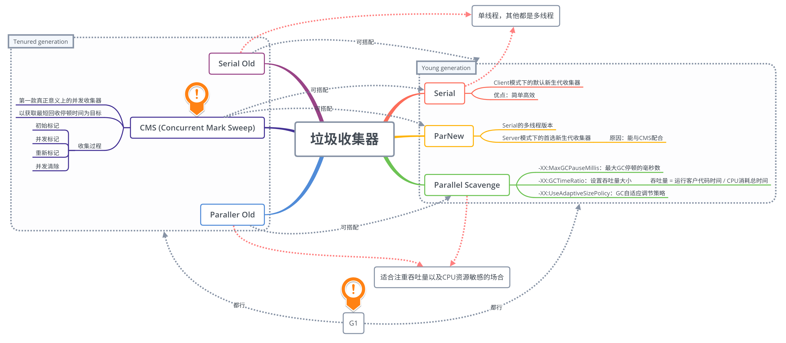

# 垃圾收集 (GC)

垃圾收集（Garbage Collection，GC），它的任务是解决以下 3 件问题：

- 哪些内存需要回收？
- 什么时候回收？
- 如何回收？

其中第一个问题很好回答，在 Java 中，GC 主要发生在 Java 堆和方法区中，对于后两个问题，我们将在之后的内容中进行讨论，并介绍 HotSpot 的 7 个垃圾收集器。

## 判断对象的生死

什么时候回收对象？当然是这个对象再也不会被用到的时候回收。所以要想解决 “什么时候回收？” 这个问题，我们要先能判断一个对象什么时候什么时候真正的 “死” 掉了，判断对象是否可用主要有以下两种方法。

### 判断对象是否可用的算法

#### 引用计数算法

- **算法描述：**
	- 给对象添加一个引用计数器；
	- 每有一个地方引用它，计数器加 1；
	- 引用失效时，计数器减 1；
	- 计数器值为 0 的对象不再可用。
- **缺点：**
	- 很难解决循环引用的问题。即 `objA.instance = objB; objB.instance = objA;`，objA 和 objB 都不会再被访问后，它们仍然相互引用着对方，所以它们的引用计数器不为 0，将永远不能被判为不可用。

#### 可达性分析算法（主流）

- **算法描述：**
	- 从 "GC Root" 对象作为起点开始向下搜索，走过的路径称为引用链（Reference Chain）；
	- 从 "GC Root" 开始，不可达的对象被判为不可用。
- **Java 中可作为 “GC Root” 的对象：**
	- 栈中（本地变量表中的reference）
		- 虚拟机栈中，栈帧中的本地变量表引用的对象；
		- 本地方法栈中，JNI 引用的对象（native方法）；
	- 方法区中
		- 类的静态属性引用的对象；
		- 常量引用的对象；

即便如此，一个对象也不是一旦被判为不可达，就立即死去的，宣告一个的死亡需要经过两次标记过程。

### 宣告对象死亡的两次标记过程

- 当发现对象不可达后，该对象被第一次标记，并进行是否有必要执行 `finalize()` 方法的判断；
	- 不需要执行：对象没有覆盖 `finalize()` 方法，或者 `finalize()` 方法已被执行过（`finalize()` 只被执行一次）；
	- 需要执行：将该对象放置在一个队列中，稍后由一个虚拟机自动创建的低优先级线程执行。
- `finalize()` 方法是对象逃脱死亡的最后一次机会，不过虚拟机不保证等待 `finalize()` 方法执行结束，也就是说，虚拟机只触发 `finalize()` 方法的执行，如果这个方法要执行超久，那么虚拟机并不等待它执行结束，所以最好不要用这个方法。
- `finalize()` 方法能做的，try-finally 都能做，所以忘了这个方法吧！

### 方法区的回收

永久代的 GC 主要回收：**废弃常量** 和 **无用的类**。

- 废弃常量：例如一个字符串 "abc"，当没有任何引用指向 "abc" 时，它就是废弃常量了。
- 无用的类：同时满足以下 3 个条件的类。
	- 该类的所有实例已被回收，Java 堆中不存在该类的任何实例；
	- 加载该类的 Classloader 已被回收；
	- 该类的 Class 对象没有被任何地方引用，即无法在任何地方通过反射访问该类的方法。

## 垃圾收集算法

### 基础：标记 - 清除算法

- **算法描述：**
	- 先标记出所有需要回收的对象（图中深色区域）；
	- 标记完后，统一回收所有被标记对象（留下狗啃似的可用内存区域……）。
- **不足：**
	- 效率问题：标记和清理两个过程的效率都不高。
	- 空间碎片问题：标记清除后会产生大量不连续的内存碎片，导致以后为较大的对象分配内存时找不到足够的连续内存，会提前触发另一次 GC。

### 解决效率问题：复制算法

- **算法描述：**

  - 将可用内存分为大小相等的两块，每次只使用其中一块；
  - 当一块内存用完时，将这块内存上还存活的对象复制到另一块内存上去，将这一块内存全部清理掉。
- **不足：** 可用内存缩小为原来的一半，适合GC过后只有少量对象存活的新生代。
- **节省内存的方法：**
	- 新生代中的对象 98% 都是朝生夕死的，所以不需要按照 1:1 的比例对内存进行划分；
	- 把内存划分为：
		- 1 块比较大的Eden区；
		- 2 块较小的Survivor区；
	- 每次使用 Eden 区和 1 块 Survivor 区；
	- 回收时，将以上 2 部分区域中的存活对象复制到另一块 Survivor 区中；
	- JVM 参数设置：`-XX:SurvivorRatio=8` 表示 `Eden 区大小 / 1 块 Survivor 区大小 = 8`。

### 解决空间碎片问题：标记 - 整理算法

- **算法描述：**
	- 标记方法与 “标记 - 清除算法” 一样；
	- 标记完后，将所有存活对象向一端移动，然后直接清理掉边界以外的内存。
- **不足：** 存在效率问题，适合老年代。

### 进化：分代收集算法

- **新生代：**GC 过后只有少量对象存活 —— **复制算法**
- **老年代：**GC 过后对象存活率高 —— **标记 - 整理算法**

## GC 算法的实现

## 7 个垃圾收集器

## GC 日志解读

