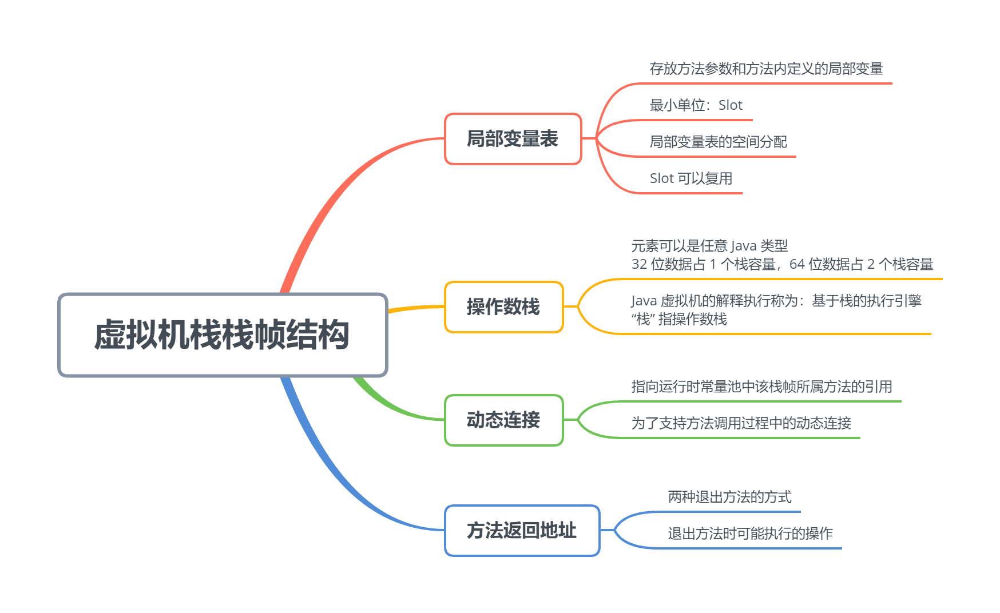
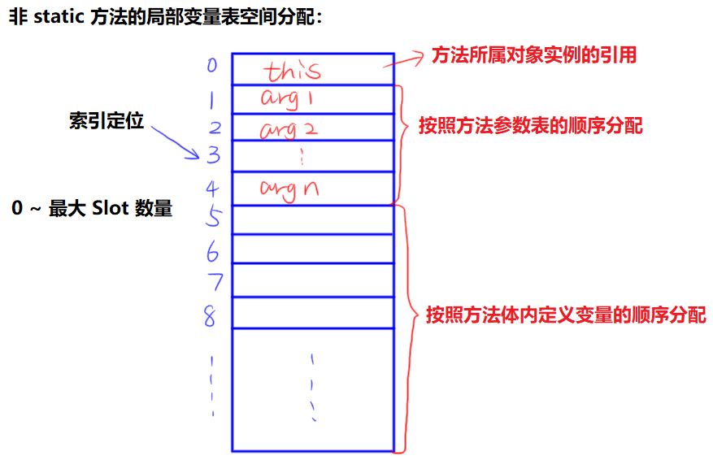

# 虚拟机栈栈帧结构



<!-- TOC -->

- [虚拟机栈栈帧结构](#虚拟机栈栈帧结构)
    - [局部变量表](#局部变量表)
        - [局部变量表的空间分配](#局部变量表的空间分配)
        - [Slot 的复用](#slot-的复用)
    - [操作数栈](#操作数栈)
    - [动态连接](#动态连接)
    - [方法返回地址](#方法返回地址)

<!-- /TOC -->

## 局部变量表

- 存放方法参数和方法内部定义的局部变量；
	- Java 程序编译为 class 文件时，就确定了每个方法需要分配的局部变量表的最大容量。
- 最小单位：Slot；
	- 一个 Slot 中可以存放：boolean，byte，char，short，int，float，reference，returnAddress (少见)；
	- 虚拟机可通过局部变量表中的 reference 做到：
		- 查找 Java 堆中的实例对象的起始地址；
		- 查找方法区中的 Class 对象。

### 局部变量表的空间分配



### Slot 的复用

**定义：** 如果当前位置已经超过某个变量的作用域时，例如出了定义这个变量的代码块，这个变量对应的 Slot 就可以给其他变量使用了。但同时也说明，只要其他变量没有使用这部分 Slot 区域，这个变量就还保存在那里，这会对 GC 操作产生影响。

**对 GC 操作的影响：**

```java
public static void main(String[] args) {
    {
    	byte[] placeholder = new byte[64 * 1024 * 1024];
    }
    System.gc();
}
```

`-verbose:gc` 输出：

```
[GC (System.gc())  68813K->66304K(123904K), 0.0034797 secs]
[Full GC (System.gc())  66304K->66204K(123904K), 0.0086225 secs]  // 没有被回收
```

进行如下修改：

```java
public static void main(String[] args) {
    {
    	byte[] placeholder = new byte[64 * 1024 * 1024];
    }
    int a = 1; // 新加一个赋值操作
    System.gc();
}
```

`-verbose:gc` 输出：

```
[GC (System.gc())  68813K->66320K(123904K), 0.0017394 secs]
[Full GC (System.gc())  66320K->668K(123904K), 0.0084337 secs]  // 被回收了
```

**第二次修改后，placeholder 能被回收的原因？**

- placeholder 能否被回收的关键：局部变量表中的 Slot 是否还存在关于 placeholder 的引用；
- 出了 placeholder 所在的代码块后，还没有进行其他操作，所以 placeholder 所在的 Slot 还没有被其他变量复用，也就是说，局部变量表的 Slot 中依然存在着 placeholder 的引用；
- 第二次修改后，int a 占用了原来 placeholder 所在的 Slot，所以可以被 GC 掉了。


## 操作数栈

- 元素可以是任意 Java 类型，32 位数据占 1 个栈容量，64 位数据占 2 个栈容量；
- Java 虚拟机的解释执行称为：基于栈的执行引擎，其中 “栈” 指的就是操作数栈；


## 动态连接

- 指向运行时常量池中该栈帧所属方法的引用；
- 为了支持方法调用过程中的动态连接，什么是动态连接会在下一篇文章进行讲解，先知道有这么个东西就行。


## 方法返回地址

- **两种退出方法的方式：**
	- 遇到 return；
	- 遇到异常。
- **退出方法时可能执行的操作：**
	- 恢复上层方法的局部变量表和操作数栈；
	- 把返回值压入调用者栈帧的操作数栈；
	- 调整 PC 计数器指向方法调用后面的指令。

