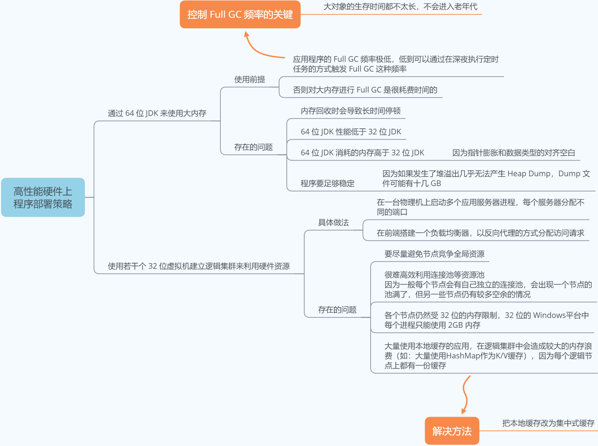

# 虚拟机调优案例分析

<!-- TOC -->

- [虚拟机调优案例分析](#虚拟机调优案例分析)
    - [高性能硬件上的程序部署策略](#高性能硬件上的程序部署策略)
    - [服务系统经常出现卡顿（Full GC 时间太长）](#服务系统经常出现卡顿full-gc-时间太长)
    - [除了 Java 堆和永久代之外，会占用较多内存的区域](#除了-java-堆和永久代之外会占用较多内存的区域)
    - [从 GC 调优角度解决新生代存活大量对象问题（Minor GC 时间太长）](#从-gc-调优角度解决新生代存活大量对象问题minor-gc-时间太长)

<!-- /TOC -->

## 高性能硬件上的程序部署策略

> **补充：64 位虚拟机**
>
> 在 Java EE 方面，企业级应用经常需要使用超过 4GB 的内存，此时，32 位虚拟机将无法满足需求，可是 64 位虚拟机虽然可以设置更大的内存，却存在以下缺点：
>
> - **内存问题：** 由于指针膨胀和各种数据类型对齐补白的原因，运行于 64 位系统上的 Java 应用程序需要消耗更多的内存，通常要比 32 位系统额外增加 10% ~ 30% 的内存消耗。
> - **性能问题：** 64 位虚拟机的运行速度在各个测试项中几乎全面落后于 32 位虚拟机，两者大概有 15% 左右的性能差距。

## 服务系统经常出现卡顿（Full GC 时间太长）

首先 `jstat -gcutil` 观察 GC 的耗时，`jstat -gccapacity` 检查内存用量（也可以加上 `-verbose:gc` 参数获取 GC 的详细日志），发现卡顿是由于 Full GC 时间太长导致的，然后 `jinfo -v pid`，查看虚拟机参数设置，发现 `-XX:NewRatio=9`，这就是原因：

- 新生代太小，对象提前进入老年代，触发 Full GC
- 老年代较大，一次 Full GC 时间较长

可以调小 NewRatio 的值，尽肯能让比较少的对象进入老年代。

## 除了 Java 堆和永久代之外，会占用较多内存的区域

| 区域          | 大小调整 / 说明                                             | 内存不足时抛出的异常                                         |
| ------------- | ----------------------------------------------------------- | ------------------------------------------------------------ |
| 直接内存      | `-XX:MaxDirectMemorySize`                                   | OutOfMemoryError: Direct buffer memory                       |
| 线程堆栈      | `-Xss`                                                      | StackOverflowError 或 OutOfMemoryError: unable to create new native thread |
| Socket 缓存区 | 每个 Socket 连接都有 Receive(37KB) 和 Send(25KB) 两个缓存区 | IOException: Too many open files                             |
| JNI 代码      | 如果代码中使用 JNI 调用本地库，那本地库使用的内存也不在堆中 |                                                              |
| 虚拟机和 GC   | 虚拟机、GC 代码执行要消耗一定内存                           |                                                              |

## 从 GC 调优角度解决新生代存活大量对象问题（Minor GC 时间太长）

- 将 Survivor 空间去除，让新生代中存活的对象在第一次 Minor GC 后立刻进入老年代，等到 Full GC 时再清理。
- 参数调整方法：
	- `-XX:SurvivorRatio=65536`
	- `-XX:MaxTenuringThreshold=0`
	- `-XX:AlwaysTenure`