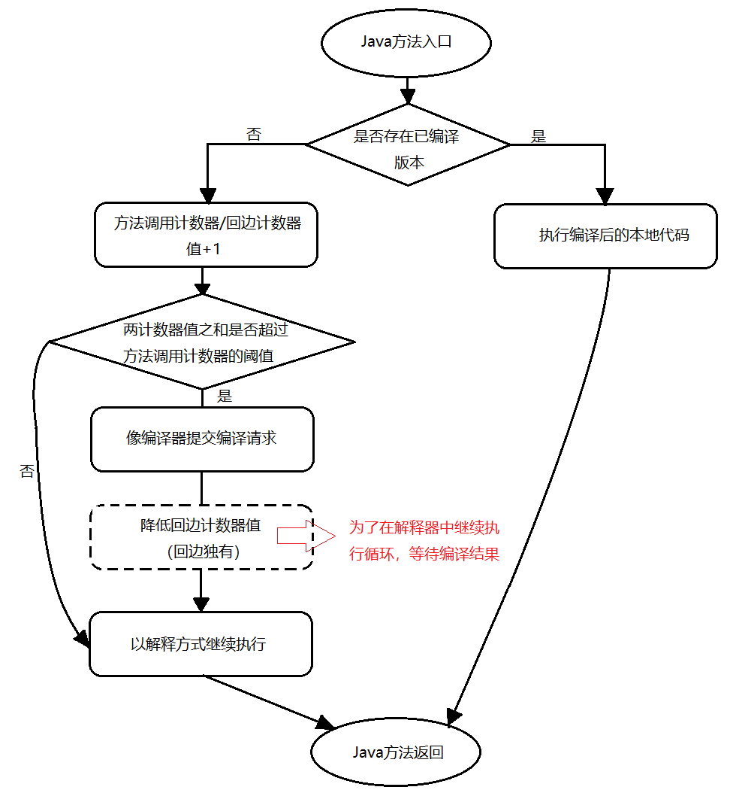

# 运行期优化


我们知道，Java 是解释执行的，可是解释执行毕竟还是有点慢的，这也使得 Java 一直被认为是效率低下的语言……，不过随着即时编译技术的发展，Java 的运行速度得到了很大的提升，在本篇文章中，我们将会对 Java 的运行期优化，也就是即时编译 (Just In Time, JIT) 时进行的优化进行详细的讲解，我们先来看看什么是即时编译。

<!-- TOC -->

- [运行期优化](#运行期优化)
    - [即时编译](#即时编译)
    - [HotSpot 虚拟机内的即时编译器运作过程](#hotspot-虚拟机内的即时编译器运作过程)
        - [为什么要使用解释器与编译器并存的架构？](#为什么要使用解释器与编译器并存的架构)
        - [为什么虚拟机要实现两个不同的 JIT 编译器？](#为什么虚拟机要实现两个不同的-jit-编译器)
        - [什么是虚拟机的分层编译？](#什么是虚拟机的分层编译)
        - [如何判断热点代码，触发编译？](#如何判断热点代码触发编译)
            - [什么是热点代码？](#什么是热点代码)
            - [什么是 “多次” 执行？](#什么是-多次-执行)
            - [HotSpot 中每个方法的 2 个计数器](#hotspot-中每个方法的-2-个计数器)
            - [HotSpot 热点代码探测流程](#hotspot-热点代码探测流程)
        - [热点代码编译的过程？](#热点代码编译的过程)
    - [经典优化技术介绍](#经典优化技术介绍)
        - [公共子表达式消除【语言无关】](#公共子表达式消除语言无关)
        - [数组范围检查消除【语言相关】](#数组范围检查消除语言相关)
        - [方法内联【最重要】](#方法内联最重要)
        - [逃逸分析【最前沿】](#逃逸分析最前沿)
            - [基本行为](#基本行为)
            - [对于不会逃逸到方法或线程外的对象能进行优化](#对于不会逃逸到方法或线程外的对象能进行优化)
            - [虚拟机参数](#虚拟机参数)
        - [一个优化的例子](#一个优化的例子)

<!-- /TOC -->

## 即时编译

**什么是即时编译？**

- 当虚拟机发现某个方法或某段代码运行的特别频繁时，会把这段代码认为成热点代码；
- 在运行时，虚拟机会将这段代码编译成平台相关的机器码，并进行各种层次的优化。


## HotSpot 虚拟机内的即时编译器运作过程

我们主要通过以下 5 个问题来了解 HotSpot 虚拟机的即时编译器。

### 为什么要使用解释器与编译器并存的架构？

- 解释器的优点：可以提高程序的响应速度（省去了编译的时间），并且节约内存。
- 编译器的优点：可以提高执行效率。
- 虚拟机参数设置：
	- 强制运行于解析模式：`-Xint`，编译器完全不工作；
	- 强制运行于编译模式：`-Xcomp`，当编译器编译失败时，解释执行还是会介入的。

### 为什么虚拟机要实现两个不同的 JIT 编译器？

- Client Compiler（C1）：不激进优化；
- Server Compiler（C2）：激进优化，如果激进优化不成立，再退回为解释执行或者 C1 编译器执行。

### 什么是虚拟机的分层编译？

分层编译就是根据编译器编译、优化的规模与耗时，划分出不同的编译层次，在代码运行的过程中，可以动态的选择将某一部分代码片段提升一个编译层次或者降低一个编译层次。

C1 与 C2 编译器会同时工作，许多代码可能会被多次编译。

**目的：** 在程序的启动响应时间和运行效率间达到平衡。

**编译层次的划分：**

- 第 0 层：解释执行，不开启性能监控；
- 第 1 层：将字节编译为机器码，但不进行激进优化，有必要时会加入性能监控；
- 第 2 层及以上：将字节编译为机器码，会根据性能监控信息进行激进优化。

### 如何判断热点代码，触发编译？

#### 什么是热点代码？

- 被多次调用的方法；
- 被多次执行的循环体；
	- 虽然被判断为热点代码的是循环体，不过因为虚拟机的即时编译是以方法为单位的，所以编译器还是会将循环体所在的方法整个作为编译对象。

我们发现，判断热点代码的一个要点就是： **多次执行** 。那么虚拟机是如何知道一个方法或者一个循环体被多次执行的呢？

#### 什么是 “多次” 执行？

- **基于采样的热点探测**
	- 虚拟机周期检查各个线程的栈顶，如果发现一个方法经常出现在栈顶，则该方法为热点方法。
	- **优点：** 容易获取方法的调用关系，且简单高效。
	- **缺点：** 无法精准的判断一个方法的热度，并且容易受到线程阻塞的影响，如果一个方法由于它所在的线程被阻塞的缘故而一直出现在栈顶，我们并不能认为这个方法被调用的十分频繁。
- **基于计数器的热点探测**
	- 虚拟机为每一个方法（或代码块）建立一个计数器，一旦执行次数超过一定阈值，就将其判为热点代码。
	- **优点：** 精确严谨。
	- **缺点：** 不能直接获取方法的调用关系，且实现复杂。
	- HotSpot 使用的是这个，并且还为每个方法建立了两个计数器。

#### HotSpot 中每个方法的 2 个计数器

- **方法调用计数器**
	- 统计方法被调用的次数，处理多次调用的方法的。
	- 默认统计的不是方法调用的绝对次数，而是方法在一段时间内被调用的次数，如果超过这个时间限制还没有达到判为热点代码的阈值，则该方法的调用计数器值减半。
		- 关闭热度衰减：`-XX: -UseCounterDecay`（此时方法计数器统计的是方法被调用的绝对次数）；
		- 设置半衰期时间：`-XX: CounterHalfLifeTime`（单位是秒）；
		- 热度衰减过程是在 GC 时顺便进行。
- **回边计数器**
	- 统计一个方法中 “回边” 的次数，处理多次执行的循环体的。
		- 回边：在字节码中遇到控制流向后跳转的指令（不是所有循环体都是回边，空循环体是自己跳向自己，没有向后跳，不算回边）。
	- 调整回边计数器阈值：`-XX: OnStackReplacePercentage`（OSR比率）
		- Client 模式：`回边计数器的阈值 = 方法调用计数器阈值 * OSR比率 / 100`；
		- Server 模式：`回边计数器的阈值 = 方法调用计数器阈值 * ( OSR比率 - 解释器监控比率 ) / 100`；

#### HotSpot 热点代码探测流程



### 热点代码编译的过程？

虚拟机在代码编译未完成时会按照解释方式继续执行，编译动作在后台的编译线程执行。

禁止后台编译：`-XX: -BackgroundCompilation`，打开后这个开关参数后，交编译请求的线程会等待编译完成，然后执行编译器输出的本地代码。


## 经典优化技术介绍

**Content：**

- 公共子表达式消除【语言无关】
- 数组范围检查消除【语言相关】
- 方法内联【最重要】
- 逃逸分析【最前沿】

### 公共子表达式消除【语言无关】

如果一个表达式 E 已经计算过了，并且从先前的计算到现在，E 中所有变量值都没有发生变化，则 E 为公共子表达式，无需再次计算，直接用之前的结果替换。

### 数组范围检查消除【语言相关】

在循环中使用循环变量访问数组，如果可以判断循环变量的范围在数组的索引范围内，则可以消除整个循环的数组范围检查

### 方法内联【最重要】

目的是：去除方法调用的成本（如建立栈帧等），并为其他优化建立良好的基础，所以一般将方法内两放在优化序列最前端，因为它对其他优化有帮助。

> **类型继承关系分析（Class Hierarchy Analysis，CHA）**
>
> 用于确定在目前已加载的类中，某个接口是否有多于一种的实现，某个类是否存在子类、子类是否为抽象类等。

- **对于非虚方法：**
	- 直接进行内联，其调用方法的版本在编译时已经确定，是根据变量的静态类型决定的。
- **对于虚方法：** （激进优化，要预留“逃生门”）
	- 向 CHA 查询此方法在当前程序下是否有多个目标可选择；
		- 只有一个目标版本：
			- 先对这唯一的目标进行内联；
			- 如果之后的执行中，虚拟机没有加载到会令这个方法接收者的继承关系发生改变的新类，则该内联代码可以一直使用；
			- 如果加载到导致继承关系发生变化的新类，就抛弃已编译的代码。
		- 有多个目标版本：
			- 使用内联缓存，未发生方法调用前，内联缓存为空；
			- 第一次调用发生后，记录调用方法的对象的版本信息；
			- 之后的每次调用都要先与内联缓存中的对象版本信息进行比较；
				- 版本信息一样，继续使用内联代码；
				- 版本信息不一样，说明程序使用了虚方法的多态特性，这时取消内联，查找虚方法进行方法分派。

### 逃逸分析【最前沿】

#### 基本行为

分析对象的作用域，看它有没有能在当前作用域之外使用：

- 方法逃逸：对象在方法中定义之后，能被外部方法引用，如作为参数传递到了其他方法中。
- 线程逃逸：赋值给 static 变量，或可以在其他线程中访问的实例变量。

#### 对于不会逃逸到方法或线程外的对象能进行优化

- **栈上分配：** 对于不会逃逸到方法外的对象，可以在栈上分配内存，这样这个对象所占用的空间可以随栈帧出栈而销毁，减小 GC 的压力。
- **标量替换（重要）：**
	- 标量：基本数据类型和 reference。
	- 不创建对象，而是将对象拆分成一个一个标量，然后直接在栈上分配，是栈上分配的一种实现方式。
	- HotSpot 使用的是标量替换而不是栈上分配，因为实现栈上分配需要更改大量假设了 “对象只能在堆中分配” 的代码。
- **锁消除：** 不会逃逸到线程外的方法不需要进行同步。

#### 虚拟机参数

- 开启逃逸分析：`-XX: +DoEscapeAnalysis`
- 开启标量替换：`-XX: +EliminateAnalysis`
- 开启锁消除：`-XX: +EliminateLocks`
- 查看分析结果：`-XX: PrintEscapeAnalysis`
- 查看标量替换情况：`-XX: PrintEliminateAllocations`

### 一个优化的例子

**原始代码：**

```java
static class B {
    int value;
    final int get() {
        return value;
    }
}

public void foo() {
    y = b.get();
    // ...do stuff...
    z = b.get();
    sum = y + z;
}
```

**第一步优化：** 方法内联（一般放在优化序列最前端，因为对其他优化有帮助）

**目的：**

- 去除方法调用的成本（如建立栈帧等）
- 为其他优化建立良好的基础

```java
public void foo() {
    y = b.value;
    // ...do stuff...
    z = b.value;
    sum = y + z;
}
```

**第二步优化：** 公共子表达式消除

```java
public void foo() {
    y = b.value;
    // ...do stuff...  // 因为这部分并没有改变 b.value 的值
                       // 如果把 b.value 看成一个表达式，就是公共表达式消除
    z = y;             // 把这一步的 b.value 替换成 y
    sum = y + z;
}
```

**第三步优化：** 复写传播

```java
public void foo() {
    y = b.value;
    // ...do stuff...
    y = y;             // z 变量与以相同，完全没有必要使用一个新的额外变量
                       // 所以将 z 替换为 y
    sum = y + z;
}
```

**第四步优化：** 无用代码消除

> **无用代码：**
>
> - 永远不会执行的代码
> - 完全没有意义的代码

```java
public void foo() {
    y = b.value;
    // ...do stuff...
    // y = y; 这句没有意义的，去除
    sum = y + y;
}
```

